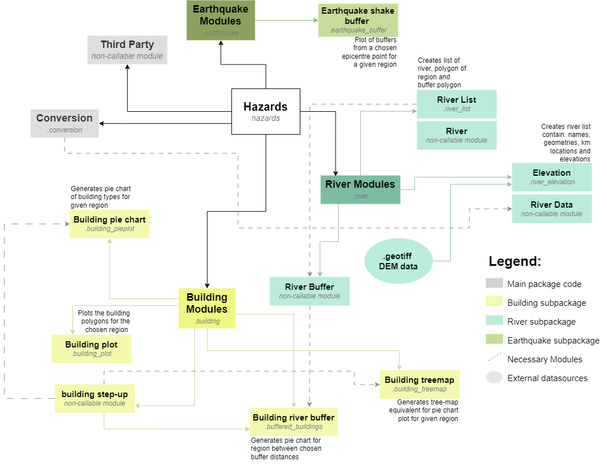

# Natural Hazard Package
[https://github.com/JoannaNoyes/Natural-Hazard-Package]
This package aims to (mostly) use only Open Street Maps (OSM) to create rudimentary hazard management analysis. This helps to kick start a larger project evaluating the need for and availability of free, easy acess datasets and simple, non-specialist ways to develop useful yet digestable hazard analysis. This was develop in the interest of non-specialist organisation and rural, low-income communities and aims to create useful datasets and plots to analyse hazards. 

This package therefore contains geospatial analysis and visualization of regions using shapefiles and OpenStreetMap data.

# Features
- Takes into account any region recognised by OSM or alternatively a chosen lat/lon box. Returns all buildings recorded in that given region
- From the chosen region can return detailed list of local rivers, as well chosen buffers away from those rivers as a first estimate of flood impact areas. This can either be distances or elevation buffers (elevation requires additional DEM .tiff file).
- Creates piecharts of the top n most common building types in the region or buffered region. The subsequent m building types are also represented in the linked bar chart.
- Treemaps of the top n most common building types in the region can be determined.
- Map of distance buffers across a region for a chosen single earthquake epicenter distance on top of buildings for that region

# Package Structure
A flow chart of the individual modules included in this package (callable and not), as well as the packages needed for each one.
 
