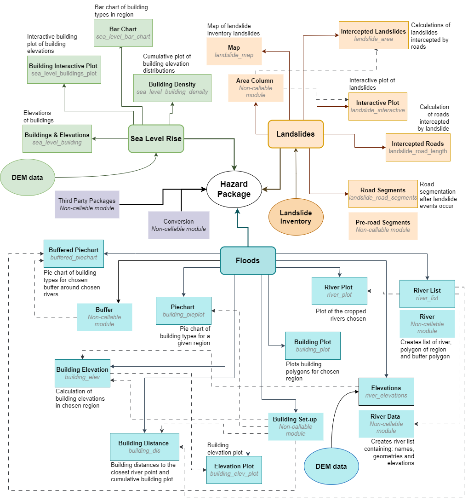

# Natural Hazard Package
[https://github.com/JoannaNoyes/Natural-Hazard-Package](https://github.com/JoannaNoyes/Natural-Hazard-Package)

This package aims to use OpenStreetMaps (OSM) and other free, third-party datasets to couple complex exposure data with simple hazard models to explore exposure and risk. This tools aims to be computationally cheap, non-specialist and globally accessible. This was developed in the interest of non-specialist organisation and communities that may lack funding or interest in hazard management. This tool is therefore usable at all levels as a beginners tool for exploring risk. 

This package therefore contains geospatial analysis and visualization of regions using shapefiles and OpenStreetMap data. The code is provided in the file s1929650_hazards_package.tar.gz

# Features
- **Flooding** sub-package: exposure related to distance, building elevation plots, building type distribution plots, etc.
- **Sea level rise** sub-package: building elevations, building type exposure plots, interactive figures, etc.
- **Landslide** sub-package: intersections between roads and landslides, impacted road lengths, impacted road maps, segmentation of road networks, interactive figures, etc.

This package utilises OSM, raster digital elevation model (DEM) data and landslide inventories.

# Package Structure
A flow chart of the individual modules included in this package (callable and not), as well as the packages needed for each one.
 

